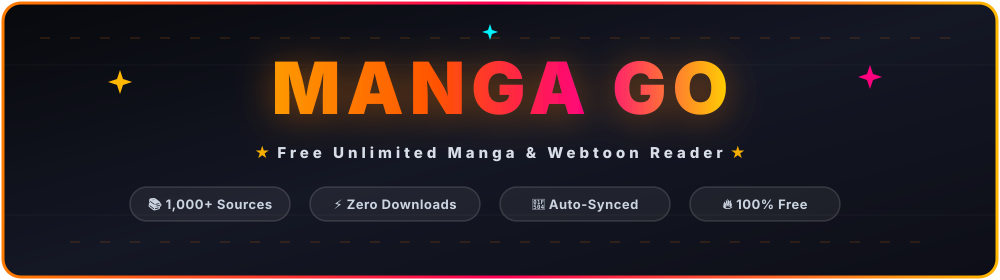

<p align="center">
  
</p>

<p align="center">
  <a href="https://rahulae161-mangagohg.hf.space/browse" target="_blank">
    
  </a>
  <a href="https://huggingface.co/spaces/rahulae161/mangagohg" target="_blank">
    
  </a>
  <a href="https://github.com/keiyoushi/extensions" target="_blank">
    
  </a>
  
</p>

---

> 🌟 **Welcome to MANGA GO!** Read thousands of manga, webtoons, manhwa, and comics directly in your browser. Powered by 1,000+ Keiyoushi extensions with **zero downloads**, **zero ads**, and **instant updates**.

---

## 🚀 Quick Start (Start Reading Now)

Click the link below to launch the live web application immediately:

🔥 **[Open MANGA GO Web App](https://rahulae161-mangagohg.hf.space/browse)**

---

## ✨ Features Overview

| Feature | Description |
| :--- | :--- |
| 📚 **1,000+ Extension Sources** | Keiyoushi Extension Store integrated with Tachiyomi Extension API v1.6 support. |
| ⚡ **Zero Downloads Needed** | Stream chapters directly in your web browser without installing apps or downloading files. |
| 🎨 **Custom Glassmorphism UI** | Injected dark mode glass interface styling (`mangago-inject.css` & `mangago-inject.js`). |
| 🔄 **Automated CI/CD Pipeline** | GitHub Actions continuously keeps Suwayomi engine preview releases up to date. |
| 📱 **Cross-Platform Responsive** | Seamless reading experience across mobile phones, tablets, and desktop displays. |
| 🌐 **100% Free & Unlimited** | Unlimited access to all catalog genres, search engines, and customizable reading modes. |

---

## 🛠️ Tech Stack & Architecture

- **Backend / Engine**: [Suwayomi Server v2.3 Preview](https://github.com/Suwayomi/Suwayomi-Server) (`ghcr.io/suwayomi/suwayomi-server:preview`) hosted on Hugging Face Spaces.
- **Extensions Store**: [Keiyoushi Repositories](https://github.com/keiyoushi/extensions) (`https://raw.githubusercontent.com/keiyoushi/extensions/repo/index.min.json`).
- **UI Customization**: Embedded CSS/JS injection engine (`mangago-inject.css`, `mangago-inject.js`).
- **Deployment Platform**: Hugging Face Spaces (Docker SDK running on port 7860).

---

## 🐳 Local Setup & Deployment

Run MANGA GO locally on your machine using Docker:

```bash
# Clone the repository
git clone https://github.com/rahulae1616-rgb/mangago-web.git
cd mangago-web

# Build the Docker container image
docker build -t mangago-web .

# Run the container locally
docker run -p 7860:7860 mangago-web
```

Once started, open **`http://localhost:7860`** in your browser.

---

<p align="center">
  Developed with ❤️ by <b>RAHUL CHANDRA</b>
</p>
